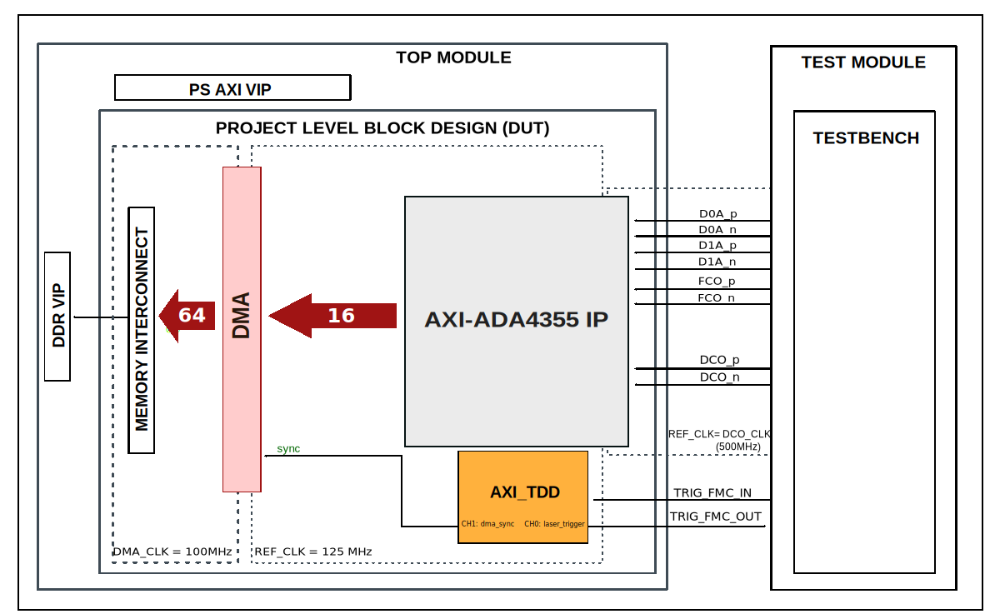

.. _ada4355:

ADA4355
================================================================================

Overview
-------------------------------------------------------------------------------

The purpose of this testbench is to validate the LVDS interface functionality
of the :git-hdl:`projects/ada4355_fmc` reference design.

The entire HDL documentation can be found here
:external+hdl:ref:`ADA4355-FMC HDL project <ada4355_fmc>`.

Block design
-------------------------------------------------------------------------------

The testbench block design includes part of the ADA4355-FMC HDL reference design,
along with VIPs used for clocking, reset, PS and DDR simulations.

Block diagram
~~~~~~~~~~~~~~~~~~~~~~~~~~~~~~~~~~~~~~~~~~~~~~~~~~~~~~~~~~~~~~~~~~~~~~~~~~~~~~~

The data path and clock domains are depicted in the below diagrams:

ADA4355 base configuration
^^^^^^^^^^^^^^^^^^^^^^^^^^^^^^^^^^^^^^^^^^^^^^^^^^^^^^^^^^^^^^^^^^^^^^^^^^^^^^^

.. image:: ./ada4355_testbench_diagram.svg
   :width: 800
   :align: center
   :alt: ADA4355/Testbench block diagram

ADA4356 TDD configuration
^^^^^^^^^^^^^^^^^^^^^^^^^^^^^^^^^^^^^^^^^^^^^^^^^^^^^^^^^^^^^^^^^^^^^^^^^^^^^^^

Configuration parameters and modes
~~~~~~~~~~~~~~~~~~~~~~~~~~~~~~~~~~~~~~~~~~~~~~~~~~~~~~~~~~~~~~~~~~~~~~~~~~~~~~~

The following parameters of this project that can be configured:

-  BUFMRCE_EN: used to differentiate between the ADA4355 and ADA4356 boards.
   Defines if the BUFMRCE primitive is used for clock gating:
   Options: 0 - Disabled (ADA4356), 1 - Enabled (ADA4355)
-  TDD_EN: enables the AXI TDD controller for LiDAR time-gated acquisition:
   Options: 0 - Disabled, 1 - Enabled
-  FRAME_SHIFT_CNT: defines the frame alignment shift count for testing
   different phase offsets between data and frame clock:
   Options: 0-7

Configuration files
^^^^^^^^^^^^^^^^^^^^^^^^^^^^^^^^^^^^^^^^^^^^^^^^^^^^^^^^^^^^^^^^^^^^^^^^^^^^^^^^

The following configuration files are available:

+-----------------------+----------------------------------------------+
| Configuration mode    | Parameters                                   |
|                       +------------+--------+------------------------+
|                       | BUFMRCE_EN | TDD_EN | FRAME_SHIFT_CNT        |
+=======================+============+========+========================+
| cfg1                  | 1          | 0      | 0                      |
+-----------------------+------------+--------+------------------------+
| cfg2                  | 0          | 0      | 0                      |
+-----------------------+------------+--------+------------------------+
| cfg_tdd               | 0          | 1      | 4                      |
+-----------------------+------------+--------+------------------------+

Tests
^^^^^^^^^^^^^^^^^^^^^^^^^^^^^^^^^^^^^^^^^^^^^^^^^^^^^^^^^^^^^^^^^^^^^^^^^^^^^^^^

The following test program files are available:

================ =============================================================
Test program     Usage
================ =============================================================
test_program     Tests the LVDS interface and DMA transfer capabilities.
test_program_tdd Tests TDD-gated LiDAR acquisition with external sync trigger.
================ =============================================================

Available configurations & tests combinations
^^^^^^^^^^^^^^^^^^^^^^^^^^^^^^^^^^^^^^^^^^^^^^^^^^^^^^^^^^^^^^^^^^^^^^^^^^^^^^^^

============= ================ ==========================================
Configuration Test             Build command
============= ================ ==========================================
cfg1          test_program     make CFG=cfg1 TST=test_program
cfg2          test_program     make CFG=cfg2 TST=test_program
cfg_tdd       test_program_tdd make CFG=cfg_tdd TST=test_program_tdd
============= ================ ==========================================

.. error::

    Mixing a wrong pair of CFG and TST will result in a simulation error.
    Please check out the proposed combinations before running a custom test.

CPU/Memory interconnect addresses
~~~~~~~~~~~~~~~~~~~~~~~~~~~~~~~~~~~~~~~~~~~~~~~~~~~~~~~~~~~~~~~~~~~~~~~~~~~~~~~

Below are the CPU/Memory interconnect addresses used in this project:

====================  ===========
Instance              Address
====================  ===========
axi_intc              0x4120_0000
axi_ada4355_adc       0x44A0_0000
axi_ada4355_dma       0x44A3_0000
axi_tdd_0 *           0x44A4_0000
ddr_axi_vip           0x8000_0000
====================  ===========

.. admonition:: Legend
   :class: note

   - ``*`` instantiated only when TDD_EN=1

Interrupts
~~~~~~~~~~~~~~~~~~~~~~~~~~~~~~~~~~~~~~~~~~~~~~~~~~~~~~~~~~~~~~~~~~~~~~~~~~~~~~~

Below are the Programmable Logic interrupts used in this project:

===============  ===
Instance name    HDL
===============  ===
axi_ada4355_dma  13
===============  ===

Test stimulus
-------------------------------------------------------------------------------

test_program
~~~~~~~~~~~~~~~~~~~~~~~~~~~~~~~~~~~~~~~~~~~~~~~~~~~~~~~~~~~~~~~~~~~~~~~~~~~~~~~

The test program is structured into several tests as follows:

Environment bringup
^^^^^^^^^^^^^^^^^^^^^^^^^^^^^^^^^^^^^^^^^^^^^^^^^^^^^^^^^^^^^^^^^^^^^^^^^^^^^^^

The steps of the environment bringup are:

* Create the environment
* Start the environment
* Start the clocks
* Assert the resets

Sanity test
^^^^^^^^^^^^^^^^^^^^^^^^^^^^^^^^^^^^^^^^^^^^^^^^^^^^^^^^^^^^^^^^^^^^^^^^^^^^^^^

This test is used to check the communication with the DMA module by running
the DMA API sanity test.

DMA test
^^^^^^^^^^^^^^^^^^^^^^^^^^^^^^^^^^^^^^^^^^^^^^^^^^^^^^^^^^^^^^^^^^^^^^^^^^^^^^^

The DMA test verifies the data capture path from the LVDS interface through
the AXI DMAC.

The steps of this test are:

* Configure the ADC interface (set control registers, number of lanes, DDR mode)
* Release the ADC from reset and assert sync_n to start data capture
* Configure the DMA (enable, set flags, transfer length, destination address)
* Start the DMA transfer
* Enable the frame pattern for data alignment
* Wait for DMA transfer completion
* Verify that captured data matches the expected sine wave pattern

Resync test
^^^^^^^^^^^^^^^^^^^^^^^^^^^^^^^^^^^^^^^^^^^^^^^^^^^^^^^^^^^^^^^^^^^^^^^^^^^^^^^

The resync test verifies that the FSM can re-align after a sync pulse.

The steps of this test are:

* Pulse sync_n low to trigger FSM reset
* Wait for FSM to complete alignment search
* Verify that the FSM has re-aligned correctly

test_program_tdd
~~~~~~~~~~~~~~~~~~~~~~~~~~~~~~~~~~~~~~~~~~~~~~~~~~~~~~~~~~~~~~~~~~~~~~~~~~~~~~~

The TDD test program extends the base test with LiDAR time-gated acquisition.
It is structured into several tests as follows:

Environment bringup
^^^^^^^^^^^^^^^^^^^^^^^^^^^^^^^^^^^^^^^^^^^^^^^^^^^^^^^^^^^^^^^^^^^^^^^^^^^^^^^

Same as the base test program.

Sanity test
^^^^^^^^^^^^^^^^^^^^^^^^^^^^^^^^^^^^^^^^^^^^^^^^^^^^^^^^^^^^^^^^^^^^^^^^^^^^^^^

Same as the base test program.

DMA test with TDD
^^^^^^^^^^^^^^^^^^^^^^^^^^^^^^^^^^^^^^^^^^^^^^^^^^^^^^^^^^^^^^^^^^^^^^^^^^^^^^^

The DMA test configures the AXI TDD controller for time-gated acquisition.

The steps of this test are:

* Configure the ADC interface and start data capture
* Configure the AXI TDD controller (frame length, channels, sync settings)
* Configure the DMA with sync transfer start enabled
* Trigger the TDD via external sync pulse
* Wait for DMA transfer completion
* Verify that captured data matches the expected sine wave pattern

TDD LiDAR test
^^^^^^^^^^^^^^^^^^^^^^^^^^^^^^^^^^^^^^^^^^^^^^^^^^^^^^^^^^^^^^^^^^^^^^^^^^^^^^^

The TDD LiDAR test verifies the full time-gated acquisition cycle with
realistic LiDAR timing parameters.

The steps of this test are:

* Configure the ADC interface and start data capture
* Reset the TDD controller FSM
* Configure TDD timing: CH0 for laser trigger pulse, CH1 for DMA sync
* Configure and arm the DMA with sync transfer start
* Enable frame pattern for data alignment
* Trigger the TDD via external sync pulse
* Wait for DMA transfer completion
* Verify that captured data matches the expected sine wave pattern

Building the testbench
-------------------------------------------------------------------------------

The testbench is built upon ADI's generic HDL reference design framework.
ADI does not distribute compiled files of these projects so they must be built
from the sources available :git-hdl:`here </>` and :git-testbenches:`here </>`,
with the specified hierarchy described :ref:`build_tb set_up_tb_repo`.
To get the source you must
`clone <https://git-scm.com/book/en/v2/Git-Basics-Getting-a-Git-Repository>`__
the HDL repository, and then build the project as follows:.

**Linux/Cygwin/WSL**

*Example 1*

Build all the possible combinations of tests and configurations, using only the
command line.

.. shell::
   :showuser:

   $cd testbenches/project/ada4355
   $make

*Example 2*

Build all the possible combinations of tests and configurations, using the
Vivado GUI. This command will launch Vivado, will run the simulation and display
the waveforms.

.. shell::
   :showuser:

   $cd testbenches/project/ada4355
   $make MODE=gui

*Example 3*

Build a particular combination of test and configuration, using the Vivado GUI.
This command will launch Vivado, will run the simulation and display the
waveforms.

.. shell::
   :showuser:

   $cd testbenches/project/ada4355
   $make MODE=gui CFG=cfg1 TST=test_program

The built projects can be found in the ``runs`` folder, where each configuration
specific build has it's own folder named after the configuration file's name.
Example: if the following command was run for a single configuration in the
clean folder (no runs folder available):

``make CFG=cfg1``

Then the subfolder under ``runs`` name will be:

``cfg1``

Resources
-------------------------------------------------------------------------------

HDL related dependencies forming the DUT
~~~~~~~~~~~~~~~~~~~~~~~~~~~~~~~~~~~~~~~~~~~~~~~~~~~~~~~~~~~~~~~~~~~~~~~~~~~~~~~

.. list-table::
   :widths: 30 45 25
   :header-rows: 1

   * - IP name
     - Source code link
     - Documentation link
   * - AXI_ADA4355
     - :git-hdl:`library/axi_ada4355`
     - ---
   * - AXI_DMAC
     - :git-hdl:`library/axi_dmac`
     - :external+hdl:ref:`axi_dmac`
   * - AXI_TDD *
     - :git-hdl:`library/axi_tdd`
     - :external+hdl:ref:`axi_tdd`

.. admonition:: Legend
   :class: note

   - ``*`` instantiated only when TDD_EN=1

Testbenches related dependencies
~~~~~~~~~~~~~~~~~~~~~~~~~~~~~~~~~~~~~~~~~~~~~~~~~~~~~~~~~~~~~~~~~~~~~~~~~~~~~~~

.. include:: ../../common/dependency_common.rst

Testbench specific dependencies:

.. list-table::
   :widths: 30 45 25
   :header-rows: 1

   * - SV dependency name
     - Source code link
     - Documentation link
   * - ADC_API
     - :git-testbenches:`library/drivers/adc/adc_api.sv`
     - ---
   * - ADI_REGMAP_ADC_PKG
     - :git-testbenches:`library/regmaps/adi_regmap_adc_pkg.sv`
     - ---
   * - ADI_REGMAP_COMMON_PKG
     - :git-testbenches:`library/regmaps/adi_regmap_common_pkg.sv`
     - ---
   * - ADI_REGMAP_DMAC_PKG
     - :git-testbenches:`library/regmaps/adi_regmap_dmac_pkg.sv`
     - ---
   * - ADI_REGMAP_PKG
     - :git-testbenches:`library/regmaps/adi_regmap_pkg.sv`
     - ---
   * - DMAC_API
     - :git-testbenches:`library/drivers/dmac/dmac_api.sv`
     - ---
   * - TDD_API *
     - :git-testbenches:`library/drivers/tdd/tdd_api.sv`
     - ---

.. admonition:: Legend
   :class: note

   - ``*`` used only by test_program_tdd

.. include:: ../../../common/more_information.rst

.. include:: ../../../common/support.rst
